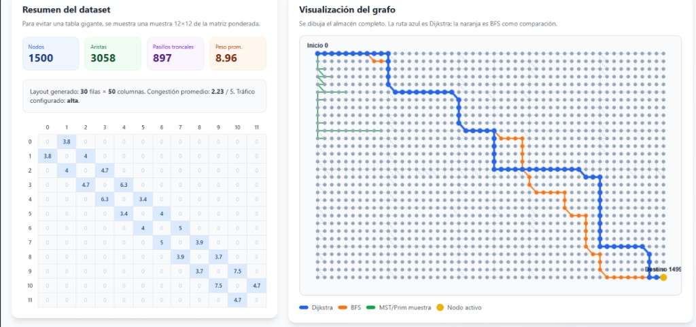
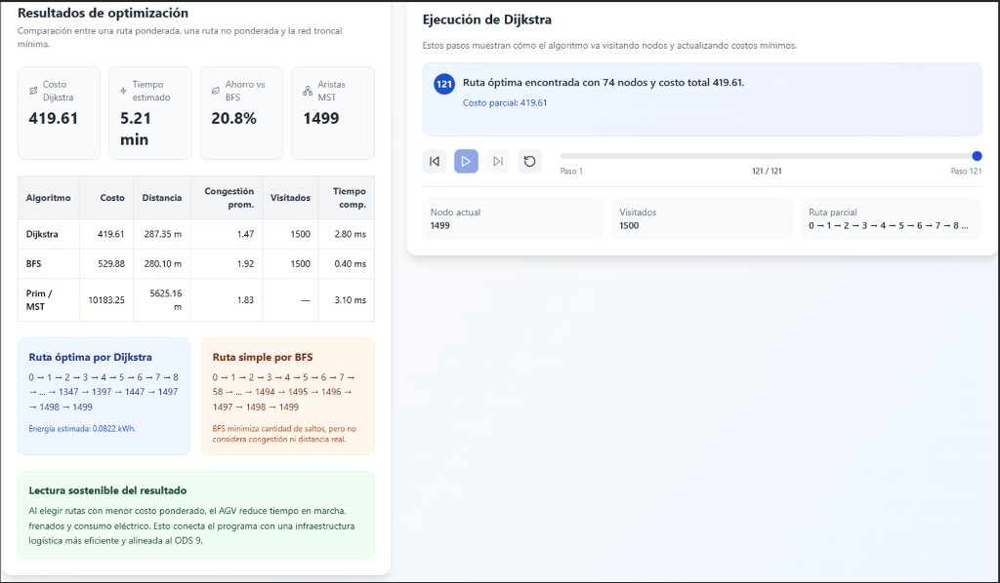

# Informe del Trabajo Final (TB2)

## SmartRoute WMS — Gestión de Almacenes Inteligentes con Optimización de Rutas AGV

**Curso:** 1ACC0184 — Complejidad Algorítmica  
**Universidad:** Universidad Peruana de Ciencias Aplicadas  
**Carrera:** Ciencias de la Computación  
**Sección:** 3202  
**Profesor:** John Edward Arias Orihuela  
**Periodo:** 2026-10  

**Integrantes:** Joseph Manuel Chavez Viera (U202314019) · Gianfranco Jared Durand Vega (U202312614) · Mario Alonso Fernandez Seer (U202317807)

**Estructura del informe:** conforme al documento oficial del curso 1ACC0184 (TB2): Descripción del problema → Dataset → Propuesta → Diseño del aplicativo → Validación → Conclusiones → Referencias.

**Código ejecutable:** carpeta `APP hecha/` · ejecutar `py -3 main.py` → http://127.0.0.1:5000

---

## Tema del aplicativo

**SmartRoute WMS** es un aplicativo de **Gestión de Almacenes Inteligentes** para centros de distribución tecnológicos con robots AGV. Resuelve una decisión que el operador repite constantemente: elegir la ruta por la que un robot debe ir del estante al despacho, considerando no solo los metros a recorrer, sino también cuán congestionado está cada pasillo.

El almacén se modela como un **grafo de 1500 nodos** (cuadrícula 30×50). El aplicativo calcula rutas con **BFS**, **Dijkstra** y **Prim (MST)**, compara resultados en tiempo, distancia y energía, y muestra visualmente cómo los pesos dinámicos de congestión cambian la decisión algorítmica.

---

## Tabla de contenidos

1. [Descripción del problema](#1-descripción-del-problema)
2. [Descripción del conjunto de datos (dataset)](#2-descripción-del-conjunto-de-datos-dataset)
3. [Propuesta](#3-propuesta) — incluye §3.3 metodología experimental y métricas
4. [Diseño del aplicativo](#4-diseño-del-aplicativo)
5. [Validación de resultados y pruebas](#5-validación-de-resultados-y-pruebas)
6. [Conclusiones](#6-conclusiones)
7. [Referencias bibliográficas](#7-referencias-bibliográficas)

---

## 1. Descripción del problema

### 1.1. Contexto y fundamentación

En la Logística 4.0, los almacenes de productos tecnológicos operan con robots AGV que comparten pasillos estrechos y manejan carga frágil. De Koster et al. (2007) estiman que el desplazamiento puede representar más del 50% del costo operativo en el *picking*. Torres-García et al. (2020) advierten que, sin coordinación algorítmica, la eficiencia de los robots cae rápidamente. Azadeh et al. (2019) identifican la planificación de rutas como el principal cuello de botella en almacenes robotizados de gran escala.

Durante picos de demanda —Cyber Wow, horas pico de despacho— las rutas fijas dejan de funcionar. Los pasillos principales se saturan, los AGV frenan y reinician, y el consumo energético aumenta. Este fenómeno es una **situación de la vida real** representable mediante un **grafo**: cada ubicación del almacén es un nodo, cada pasillo es una arista, y el peso de esa arista varía con la congestión.

### 1.2. Planteamiento del problema

> Dado un almacén modelado como grafo G = (V, E) de 1500 nodos con pesos dinámicos por congestión, determinar la ruta óptima entre origen (picking) y destino (despacho), comparar técnicas de búsqueda en grafos (BFS, Dijkstra) y analizar la infraestructura (MST con Prim), evaluando el impacto en tiempo de tránsito y consumo energético de los AGV.

### 1.3. Objetivos

**General:** Desarrollar un aplicativo de gestión de almacenes inteligentes que optimice rutas AGV mediante teoría de grafos, reduciendo tiempos y consumo energético bajo congestión dinámica.

**Específicos:**

1. Modelar un almacén de 1500 nodos con dataset sintético.
2. Implementar BFS, Dijkstra, Prim y técnicas complementarias (Bellman-Ford, Floyd-Warshall, Kruskal, UFDS).
3. Simular franjas de congestión y comparar rutas en la GUI.
4. Validar coherencia de rutas y métricas operativas.
5. Demostrar resultados en interfaz gráfica.

### 1.4. Competencias del curso

**Razonamiento Cuantitativo (Nivel 2):** experimentación con el aplicativo, análisis de métricas reales (costo, tiempo, energía, ahorro vs BFS) e interpretación con juicio de ingeniería.

**ABET 4 — Responsabilidad y ética:** solución alineada al ODS 9; el aplicativo incluye lectura sostenible del resultado (menor consumo eléctrico, menos frenadas).

---

## 2. Descripción del conjunto de datos (dataset)

### 2.1. Origen

El dataset es **sintético**, adaptado de benchmarks de Azadeh et al. (2019). Permite reproducir escenarios controlados sin depender de planos confidenciales de almacenes reales.

### 2.2. Características del grafo

El aplicativo genera un layout de **30 filas × 50 columnas = 1500 nodos**, con las siguientes métricas obtenidas en ejecución:

| Atributo | Valor |
|----------|-------|
| Nodos (&#124;V&#124;) | 1500 |
| Aristas (&#124;E&#124;) | 2920 |
| Pasillos principales | 829 |
| Peso promedio (franja alta) | 6.28 |
| Congestión promedio (franja alta) | 2.41 / 5 |
| Layout | Cuadrícula 30×50 (120 m × 80 m) |
| Escenario canónico de validación | Estante **nodo 1499** (ALMACEN, Sector H) → muelle **nodo 0** (DESPACHO) |
| Entrada alternativa en la GUI | Si el operador indica 0→1499, la app normaliza a 1499→0 (`normalize_route_endpoints`) |

Cada nodo tiene coordenadas `(x, y)`, tipo (ALMACEN, INTERSECCION, DESPACHO, RECARGA) y sector (A–H). Las aristas conectan nodos adyacentes en la cuadrícula y portan distancia euclidiana, tipo de pasillo y factor de congestión.

### 2.3. Modelo de pesos dinámicos

```
w(u, v) = d(u, v) × c(franja, tipo_pasillo)
```

| Franja | Horario | Principal | Secundario | Acceso despacho |
|--------|---------|-----------|------------|-----------------|
| Baja | 00:00–06:00 | 1.0 | 1.0 | 1.1 |
| Media | 08:00–14:00 | 2.0 | 1.3 | 1.8 |
| Alta | 18:00–23:00 | 4.5 | 1.5 | 3.5 |

En la ejecución de validación documentada en este informe, el tráfico se configuró en franja **alta** para evidenciar la divergencia entre BFS y Dijkstra.

### 2.4. Visualización del conjunto de datos (Grafo)

A continuación se presentan las visualizaciones del aplicativo SmartRoute WMS sobre el grafo de 1500 nodos, con tráfico en franja **alta** y **escenario canónico de validación**: recogida en estante **nodo 1499** (ALMACEN, esquina inferior derecha) → entrega en muelle **nodo 0** (DESPACHO, esquina superior izquierda). Este recorrido modela la operación real de *picking* a despacho.

> **Nota sobre nodos 0 y 1499:** el nodo 0 es un **muelle de despacho** y el 1499 un **estante de almacén**. No representan “inicio/fin geográfico” arbitrario, sino **entrega** y **recogida** respectivamente. Si en la GUI se ingresa 0→1499, el sistema intercambia automáticamente a 1499→0.

---

#### Figura 1 — Resumen del dataset y grafo completo

El panel izquierdo muestra las métricas del grafo (1500 nodos, 2920 aristas, peso y congestión en franja alta) y una muestra de la matriz de adyacencia ponderada (submatriz 12×12). El panel derecho muestra el layout 30×50 con:

- **Muelle de despacho (nodo 0)** — esquina superior izquierda (tipo DESPACHO).
- **Estante de recogida (nodo 1499)** — esquina inferior derecha (tipo ALMACEN).
- **Ruta Dijkstra (verde/azul)** — camino de menor costo ponderado (1499 → 0).
- **Ruta BFS (amarilla/naranja)** — camino con menos saltos; diverge en pasillos más congestionados.
- **Muestra MST/Prim (verde tenue)** — en la Figura 1 del informe académico; solo ilustrativo. **No se muestra en la app web** porque un mapa parcial del MST confunde al operador (no es una ruta de picking).



| Aporte | Descripción |
|--------|-------------|
| **Algorítmico** | Confirma conectividad; contrasta camino mínimo ponderado (Dijkstra) vs camino por saltos (BFS); visualiza estructura MST. |
| **Logístico** | Bajo tráfico alto, BFS y Dijkstra pueden medir igual en metros pero diferir en congestión; Dijkstra evita pasillos saturados del recorrido 1499→0. |

---

#### Figura 2 — Resultados de optimización y ejecución de Dijkstra

El panel izquierdo presenta los KPIs y la tabla comparativa entre BFS, Dijkstra y Prim. El panel derecho muestra la animación paso a paso de la ejecución de Dijkstra (121 pasos, 1500 nodos explorados, ruta óptima de 74 nodos).



| Elemento | Valor obtenido (1499 → 0, franja alta) |
|----------|----------------|
| Costo Dijkstra | 391.93 |
| Costo BFS | 715.20 |
| Tiempo estimado AGV (Dijkstra) | 4.35 min |
| Ahorro vs BFS | **45.2%** |
| Nodos en ruta Dijkstra | 79 |
| Distancia en ruta | 200.01 m (ambas rutas; divergen en pasillos) |
| Congestión prom. Dijkstra / BFS | 1.95 / 3.64 |
| Energía estimada Dijkstra / BFS | 14.60 / 25.38 kWh |
| Aristas MST | 1499 |

| Aporte | Descripción |
|--------|-------------|
| **Algorítmico** | Evidencia cuantitativamente que Dijkstra supera a BFS en costo ponderado (45.2%); Bellman-Ford valida la optimalidad (`valid: true`). |
| **Logístico** | Misma distancia en metros, pero BFS atraviesa pasillos con el doble de congestión promedio; el AGV ahorra ~3.6 min y ~10.8 kWh por trayecto. |

---

### 2.5. Relación con grafos

G = (V, E, w) es no dirigido, conexo, con pesos no negativos y |E| = 2920. Estas propiedades habilitan BFS, Dijkstra, Prim y las técnicas complementarias del curso.

---

## 3. Propuesta

### 3.1. Objetivo

Implementar **SmartRoute WMS**, un aplicativo que integre técnicas de complejidad algorítmica para gestionar rutas AGV, comparar algoritmos en la misma instancia del grafo y apoyar decisiones operativas e de infraestructura.

### 3.2. Técnicas del curso: uso en el almacén y en el aplicativo

El curso exige técnicas de **recorrido y búsqueda en grafos**, **UFDS**, **MST (Prim/Kruskal)**, **Bellman-Ford** y **Floyd-Warshall**. Todas están implementadas en **Python** (`src/algoritmos.py`) y se invocan desde la capa de servicio (`src/service.py`) y la API Flask. La tabla siguiente articula **por qué** cada técnica aporta a la gestión del almacén y **dónde** el operador o el evaluador puede verificar su ejecución en la GUI.

| Técnica | Complejidad | Aporte al almacén inteligente | Implementación / demostración en la app |
|---------|-------------|------------------------------|----------------------------------------|
| **BFS** | O(V + E) | Ruta con menos saltos; referencia «ir directo» cuando el tráfico es bajo | `bfs_path()` → ruta **amarilla** en mapa; comparativa en pestaña *Comparar rutas* |
| **Dijkstra** | O(E + V log V) | **Ruteo operativo diario** con pesos por congestión; evita pasillos saturados en hora pico | `dijkstra_path()` → ruta **verde** recomendada; KPIs tiempo, energía, ahorro % |
| **Bellman-Ford** | O(V · E) | **Auditoría** de optimalidad tras cambiar pesos; detectaría ciclos negativos si se modelaran bonificaciones | `bellman_ford_path()` en cada `POST /api/route`; validación en tabla de algoritmos (costo ≈ Dijkstra) |
| **Prim (MST)** | O(E log V) | **Red mínima** que conecta todo el almacén | `prim_mst()` → listado en pestaña *Pasillos críticos* |
| **Kruskal (MST)** | O(E log E) | Verificación del MST | Misma pestaña + *Comparar rutas* |
| **UFDS** | O(α(V)) | Simular cierre de pasillo | *Pasillos críticos* → Simular cierre |
| **Floyd-Warshall** | O(V³) | Matriz entre sectores | *Pasillos críticos* → Matriz Floyd-Warshall |

**Técnicas de recorrido en grafos (requisito del curso):** BFS y Dijkstra cubren búsqueda de caminos; el resto cubre MST, programación dinámica sobre grafos (Floyd-Warshall) y validación (Bellman-Ford, UFDS).

#### BFS — Conectividad y ruteo en baja demanda (O(V+E))

**Problema que resuelve:** ¿Existe camino? ¿Cuál es la ruta con menos saltos?

**En el almacén:** En turno nocturno o baja demanda, cuando todos los pasillos tienen c ≈ 1.0, BFS devuelve la ruta más directa. También sirve como **línea base** para medir cuánto mejora Dijkstra.

**Escenario real:** Mantenimiento a las 3 am con 2 AGV en todo el almacén.

**Cuándo no usarlo:** En franja alta. Como muestra la Figura 1, BFS (naranja) atraviesa la zona central congestionada mientras Dijkstra (azul) se desvía.

---

#### Dijkstra — Ruteo operativo con congestión (O(E + V log V))

**Problema que resuelve:** ¿Qué ruta minimiza el costo operativo real integrando distancia y congestión?

**En el almacén:** Es el **motor de ruteo diario** del WMS. En el escenario canónico (1499 → 0, franja alta), Dijkstra obtuvo costo **391.93** frente a **715.20** de BFS, un **ahorro del 45.2%**, con congestión promedio en ruta **1.95** frente a **3.64** de BFS (misma distancia en metros, distinto perfil de pasillos).

**Escenario real:** Cyber Wow: recoger en estante Sector H y despachar en muelle A1 con tráfico en hora pico.

**Cuándo no usarlo:** Solo para verificar conectividad (usar BFS).

---

#### Prim (MST) — Red mínima de infraestructura (O(E log V))

> **Aclaración importante:** el MST **no** identifica “pasillos congestionados” ni la ruta de un AGV. Es el **árbol de expansión mínima**: el conjunto de **1499 aristas** con menor costo total que mantiene conectados los **1500 nodos**. En logística sirve para saber qué corredores son **estructuralmente indispensables** (si se cierran, el almacén se desconecta), no para decir por dónde ir a recoger un producto.

**Problema que resuelve:** ¿Cuál es la red mínima de pasillos que conecta todo el almacén?

**En el almacén:** No define una ruta punto a punto; identifica **829 pasillos principales** y un árbol de **1499 aristas** con costo MST **6844.94** (franja alta). Sirve al planificador de infraestructura: qué pasillos no se pueden cerrar sin desconectar el almacén.

**Escenario real:** Decisión de ampliar un corredor o invertir en vía alternativa.

**Cuándo no usarlo:** Asignar ruta a un AGV en operación diaria.

---

#### Bellman-Ford — Validación de optimalidad (O(V×E))

**Problema que resuelve:** Confirmar que el camino de Dijkstra sigue siendo mínimo tras actualizar pesos.

**En el almacén:** Capa de auditoría. Si en el futuro se modelan bonificaciones por pasillos vacíos (pesos negativos), Bellman-Ford detectaría ciclos. Con pesos actuales no negativos, debe coincidir con Dijkstra.

---

#### Floyd-Warshall — Matriz inter-sectorial (O(V³))

**Problema que resuelve:** ¿Cuánto cuesta ir de cualquier sector a cualquier otro?

**En el almacén:** El supervisor consulta la matriz 8×8 de sectores sin calcular ruta por ruta. Se ejecuta sobre nodos hub de cada sector para mantener eficiencia.

---

#### Kruskal + UFDS — Verificación MST y conectividad dinámica

**Kruskal** valida que costo(MST Prim) = costo(MST Kruskal). **UFDS** permite simular cierre de pasillos: si al desactivar una arista troncal dos sectores quedan en componentes distintas, el aplicativo alerta antes de programar mantenimiento.

### 3.3. Metodología experimental y métricas de evaluación

La validación conecta la **lógica del almacén** con los **algoritmos del curso** mediante un protocolo reproducible:

| Paso | Acción | Propósito |
|------|--------|-----------|
| 1 | Generar G con `build_graph()` (semilla 42) | Dataset sintético reproducible de 1500 nodos |
| 2 | Aplicar franja de tráfico (`apply_traffic`) | Modelar congestión dinámica por tipo de pasillo |
| 3 | Normalizar origen/destino (`normalize_route_endpoints`) | Garantizar flujo operativo estante → muelle |
| 4 | Verificar conectividad con **UFDS** | Rechazar rutas imposibles antes de optimizar |
| 5 | Ejecutar **BFS**, **Dijkstra**, **Bellman-Ford**, **Prim**, **Kruskal** | Comparar técnicas en la misma instancia |
| 6 | Calcular métricas operativas (`path_metrics`) | Traducir resultado algorítmico a decisión logística |
| 7 | Registrar en GUI, API y `tests/test_logica.py` | Evidencia para exposición y defensa oral |

**Fórmulas de métricas** (implementadas en `src/metricas.py`):

```
w(u,v) = d(u,v) × c(franja, tipo_pasillo)     # peso de arista
costo_ruta = Σ w(u,v)                            # costo ponderado (Dijkstra lo minimiza)
tiempo_min = costo_ruta / (AGV_SPEED × 60)       # AGV_SPEED = 1.5 m/s
energía_kWh = 0.05 × tiempo_s + 0.02 × frenadas # modelo simplificado de consumo
congestión_prom = promedio de c en aristas de la ruta
ahorro_% = (costo_BFS − costo_Dijkstra) / costo_BFS × 100
```

**Escenario canónico del informe:** nodo **1499** (ALMACEN) → nodo **0** (DESPACHO), franja **alta**, robot **estándar**. Todos los valores de las secciones 2.4, 5.2 y 5.4 corresponden a esta instancia, verificable con `py -3 scripts/generar_validacion.py` y `GET /api/validation`.

### 3.4. Procedimiento de implementación

1. Generar grafo 30×50 (1500 nodos).
2. Asignar pesos según franja horaria.
3. Ejecutar BFS, Dijkstra, Prim y técnicas complementarias.
4. Calcular métricas operativas.
5. Visualizar en GUI y validar coherencia.

### 3.5. Limitaciones del modelo y trabajo futuro

- **Sin multi-agente (MAPF):** no coordina varios AGV simultáneos en el mismo pasillo; dos robots podrían colisionar si siguen rutas independientes.
- **Sin restricciones físicas:** no modela anchura de pasillo, giros prohibidos, altura de carga ni zonas frágiles.
- **Congestión por franja:** no usa sensores IoT en tiempo real; el factor c es determinístico por horario y tipo de pasillo.
- **Topología estática:** no contempla cierres temporales salvo la simulación manual con UFDS.
- **Energía simplificada:** el modelo lineal de kWh no reemplaza mediciones reales de batería del AGV.

**Trabajo futuro:** integrar **MAPF** multi-AGV, **A\*** con heurística espacial, calibración de pesos con datos históricos y sensores de ocupación en pasillos.

---

## 4. Diseño del aplicativo

### 4.1. Etapas de ingeniería de software

**Requerimientos → Diseño → Implementación → Pruebas → Despliegue**

#### Requerimientos funcionales

- Representar el almacén como grafo de 1500 nodos.
- Configurar franja de tráfico (baja / media / alta).
- Seleccionar origen (estante) y destino (muelle de despacho).
- Elegir perfil de robot AGV (estándar, pesado, express, refrigerado).
- Consultar inventario: búsqueda por nodo, SKU o producto; catálogo y contenido por pasillo.
- Calcular rutas BFS y Dijkstra; MST con Prim; simular cierre de pasillos (UFDS).
- Mostrar mapa, métricas, stock, veredicto «¿por qué esta ruta sí/no?» y pasillos del recorrido.
- Ruta aleatoria para demostración (estante → despacho).

#### Requerimientos no funcionales

- Dijkstra en menos de 5 s (en prueba: **~3 ms** en instancia completa).
- Interfaz web para demostración en exposición (10 min).
- **Motor y lógica de negocio en Python** (Flask + `src/`); interfaz en HTML/CSS/JS.

### 4.2. Arquitectura (implementación actual)

```
Interfaz web (HTML · CSS · JavaScript)
        ↓  REST API
Servidor Flask (server.py)
        ↓
Capa de servicio (service.py · catalogo.py · inventario.py)
        ↓
Algoritmos (BFS · Dijkstra · Bellman-Ford · Floyd-Warshall · Prim · Kruskal · UFDS)
        ↓
Datos (grafo G, 1500 nodos, pesos dinámicos, inventario sintético)
        ↓
Visualización (Matplotlib → mapa en navegador)
```

**Ubicación del código ejecutable:** carpeta `APP hecha/` (ver `APP hecha/README.md`).

### 4.3. Pantallas del aplicativo

#### Informe académico (figuras de validación)

**Pantalla 1 — Dataset y grafo (ver Figura 1, sección 2.4):** resumen de nodos, aristas, pesos y visualización de rutas BFS, Dijkstra y MST sobre el layout completo.

**Pantalla 2 — Resultados de optimización (ver Figura 2, sección 2.4):** tarjetas de KPI, tabla comparativa, detalle de rutas, lectura sostenible y animación paso a paso de Dijkstra.

La Figura 2 incluye:

| Elemento | Contenido |
|----------|-----------|
| KPIs | Costo Dijkstra 391.93 · Tiempo 4.35 min · Ahorro vs BFS 45.2% · Aristas MST 1499 |
| Tabla comparativa | BFS, Dijkstra y Prim con costo, distancia, congestión prom. y tiempo de cómputo |
| Ruta Dijkstra | 79 nodos de 1499 a 0; energía estimada **14.60 kWh** |
| Animación | Ejecución paso a paso (121 pasos); 1500 nodos explorados |
| Lectura sostenible | Menor costo ponderado → menos tiempo, frenadas y electricidad (ODS 9) |

#### Aplicación web para el cliente (versión entregable)

| Vista | Contenido |
|-------|-----------|
| **Inicio** | Presentación, beneficios, guía «Cómo funciona» |
| **Productos** | Catálogo con KPIs, chips por familia, ordenación, detalle de pasillo y acciones «Recoger» / «Calcular ruta» |
| **Navegar** | Mapa interactivo SVG (zoom, clic en nodos), barra de viaje, historial de rutas, stock, veredicto, pestañas Comparar / Pasillos / Infra |
| **Planificar ruta** (panel) | Robot, tráfico, búsqueda, origen/destino, ruta aleatoria |
| **Sobre la app** | Contexto académico y equipo |

**Barra superior:** Inicio · Beneficios · **Productos** · Navegar · Sobre la app · Planificar ruta.

### 4.4. API REST (lógica en Python)

| Endpoint | Método | Función |
|----------|--------|---------|
| `/api/route` | POST | Calcula ruta (BFS + Dijkstra + métricas + mapa interactivo) |
| `/api/route/preview` | POST | Métricas rápidas sin imagen (cambio de franja) |
| `/api/map/layout` | GET | Coordenadas de 1500 nodos para mapa SVG |
| `/api/history` | GET | Últimas 3 rutas de la sesión |
| `/api/validation` | GET | Casos CP automatizados (documentación) |
| `/api/productos` | GET | Catálogo, resumen de inventario y búsqueda |
| `/api/search` | GET | Búsqueda por nodo, SKU o producto |
| `/api/pasillo` | GET | Contenido de un pasillo (`?nodo=` o `?sector=&letra=`) |
| `/api/pasillos` | GET | Listado de pasillos con muestra de productos |
| `/api/node/<id>` | GET | Detalle de nodo y stock |
| `/api/random-route` | GET | Par aleatorio estante → despacho |
| `/api/defaults` | GET | Origen y destino válidos por defecto |
| `/api/infra/mst` | POST | Visualización MST (Prim / Kruskal) |
| `/api/infra/close` | POST | Simula cierre de pasillo troncal |
| `/api/infra/reset` | POST | Restaura pasillos |
| `/api/health` | GET | Verificación de servicio y grafo |

### 4.5. Flujo del usuario (aplicación web)

1. Ejecutar `py -3 main.py` y abrir **http://127.0.0.1:5000**.
2. En **Productos**, buscar un artículo (ej. SSD) o usar un chip de categoría.
3. Pulsar **Recoger aquí** o **Calcular ruta al muelle** en el detalle del producto.
4. En **Planificar ruta**, elegir robot y franja de tráfico; confirmar origen/destino.
5. Ir a **Navegar** y pulsar **Calcular** (o usar ruta aleatoria).
6. Revisar mapa (verde = Dijkstra recomendada, amarilla = BFS directa), KPIs y «¿Por qué esta ruta?».
7. Consultar **Pasillos en ruta** para ver qué hay en cada pasillo del recorrido.
8. Opcional: pestaña **Infraestructura** — simulación de cierre (UFDS) y matriz Floyd-Warshall.

### 4.6. Cumplimiento de objetivos específicos

| Objetivo | Estado |
|----------|--------|
| Modelar almacén 1500 nodos | ✓ `src/grafo.py` |
| BFS, Dijkstra, Prim, Bellman-Ford, Floyd, Kruskal, UFDS | ✓ `src/algoritmos.py` |
| Simular congestión y comparar rutas en GUI | ✓ Vista Navegar + API |
| Validar coherencia y métricas | ✓ Sección 5 + `tests/test_logica.py` |
| Demostrar en interfaz gráfica | ✓ Web Flask + figuras del informe |

### 4.7. Instalación rápida

```powershell
cd "APP hecha"
py -3 -m pip install -r requirements.txt
py -3 main.py
```

Documentación técnica de la app: **`APP hecha/README.md`**.

---

### 4.8. Flujo de validación académica (demostración en exposición)

1. Abrir SmartRoute WMS (`run.bat` → http://127.0.0.1:5000).
2. Revisar Figura 1 (dataset y divergencia visual de rutas).
3. En **Planificar ruta**, configurar franja **alta**, origen **1499**, destino **0** (o ingresar 0→1499 y verificar normalización).
4. Ir a **Navegar** → **Calcular** y revisar mapa interactivo, KPIs y veredicto.
5. Pestaña **Comparar rutas**: tabla de algoritmos con tiempos de ejecución (ms).
6. Pestaña **Infraestructura**: simulación UFDS y Floyd-Warshall (MST solo como números en *Comparar rutas*).
7. Explicar aporte algorítmico (45.2% ahorro) y logístico (menos congestión, ODS 9).

---

## 5. Validación de resultados y pruebas

### 5.1. Entradas, salidas y escenario canónico

| Elemento | Valor |
|----------|-------|
| Grafo G | 1500 nodos, 2920 aristas |
| Franja | Alta (hora pico) |
| Origen (recogida) | Nodo **1499** — ALMACEN, Sector H |
| Destino (entrega) | Nodo **0** — DESPACHO, Muelle A1 |
| Robot | AGV Estándar |
| Semilla del dataset | 42 (reproducible) |

**Salidas verificadas:** rutas BFS y Dijkstra, métricas operativas, MST (Prim/Kruskal), validación Bellman-Ford, figuras y evidencia en la aplicación web.

> Si se ingresa origen=0 y destino=1499 en la GUI, el sistema **intercambia** automáticamente a 1499→0 porque 0 es muelle y 1499 es estante. El costo y el ahorro % son idénticos; solo cambia la presentación al operador.

### 5.2. Resultados obtenidos (escenario canónico 1499 → 0, franja alta)

| Algoritmo | Costo ponderado | Distancia (m) | Congestión prom. | Tiempo cómputo |
|-----------|-----------------|---------------|------------------|----------------|
| **Dijkstra** | 391.93 | 200.01 | 1.95 | 4.99 ms |
| **BFS** | 715.20 | 200.01 | 3.64 | 2.28 ms |
| **Prim (MST)** | 6844.94 | — | — | 10.16 ms |
| **Bellman-Ford** | 391.93 (validación) | 200.01 | 1.95 | 3.90 ms |

| Indicador operativo | Valor |
|---------------------|-------|
| Tiempo estimado de tránsito AGV (Dijkstra) | 4.35 min |
| Tiempo estimado ruta BFS | 7.95 min |
| Ahorro Dijkstra vs BFS | **45.2%** |
| Nodos en ruta | 79 (ambas técnicas; caminos divergen desde el paso 2) |
| Energía estimada Dijkstra / BFS | 14.60 / 25.38 kWh |
| Aristas MST | 1499 (= &#124;V&#124; − 1) |
| Prim = Kruskal | Sí (6844.94) |

### 5.3. Reglas de coherencia verificadas (validación explícita)

La validación no se limita a mostrar gráficos: se definieron **reglas verificables** que conectan la lógica del almacén con los resultados algorítmicos:

| Regla | Método de verificación | Criterio de éxito |
|-------|------------------------|-------------------|
| **Continuidad de ruta** | Cada par consecutivo en el camino debe ser arista del grafo | ✓ Camino válido en cuadrícula |
| **Conectividad origen–destino** | UFDS antes de calcular; rechazo si no hay camino | ✓ Mensaje de error o ruta generada |
| **Origen operativo** | Normalización estante (ALMACEN) → muelle (DESPACHO) | ✓ `normalize_route_endpoints()` |
| **Optimalidad Dijkstra** | Bellman-Ford debe coincidir con Dijkstra (pesos ≥ 0) | ✓ `bellman_ford.valid` en API |
| **MST consistente** | costo(Prim) ≈ costo(Kruskal) | ✓ Tabla en *Comparar rutas* y `POST /api/infra/mst` |
| **Respuesta a congestión** | Congestión prom. Dijkstra < BFS en franja alta | ✓ 1.95 vs 3.64 (misma distancia, distinto perfil de pasillos) |
| **Métricas operativas** | Tiempo, distancia, energía, % ahorro derivados del camino | ✓ KPIs en vista *Navegar* |
| **Pruebas automatizadas** | `tests/test_logica.py` — 15 tests | ✓ `py -3 -m pytest tests/ -q` |

**Cómo se verifica la coherencia con la lógica del almacén:**

1. **Tipos de nodo:** solo se acepta flujo estante (ALMACEN) → muelle (DESPACHO); la normalización corrige entradas invertidas.
2. **Continuidad:** cada par consecutivo `(u,v)` en la ruta debe existir como arista en la cuadrícula 30×50.
3. **Congestión:** el factor c de cada arista depende de la franja y del `tipo_pasillo` (PRINCIPAL, SECUNDARIO, ACCESO_DESPACHO).
4. **Optimalidad:** con pesos ≥ 0, Bellman-Ford debe coincidir con Dijkstra (`bellman_ford.valid` en la API).
5. **Infraestructura:** MST con 1499 aristas conecta los 1500 nodos; Prim y Kruskal deben coincidir.

**Interpretación operativa de métricas:** el **costo ponderado** integra distancia × congestión; el **tiempo AGV** deriva del costo y la velocidad base (1.5 m/s); la **energía** modela tiempo de motor + frenadas por cambio de dirección; el **% de ahorro** cuantifica la ventaja de Dijkstra frente a BFS en la **misma instancia**.

### 5.4. Reglas de coherencia (escenario documentado 1499 → 0)

| Regla | Verificación | Resultado |
|-------|--------------|-----------|
| Tipos de nodo | 1499=ALMACEN, 0=DESPACHO | ✓ Flujo picking → despacho |
| Conectividad | Existe camino 1499 → 0 | ✓ UFDS + ambos algoritmos encuentran ruta |
| Continuidad | Cada paso es arista adyacente | ✓ 79 nodos consecutivos en Dijkstra |
| Divergencia de rutas | BFS y Dijkstra no siguen el mismo camino | ✓ Divergen desde el paso 2 (Figura 1) |
| BFS vs Dijkstra | Misma distancia (200.01 m) pero distinto costo | ✓ 715.20 vs 391.93; BFS más congestionada |
| MST | 1499 aristas conectan 1500 nodos | ✓ &#124;E_MST&#124; = &#124;V&#124; − 1 |
| Optimalidad | Dijkstra menor costo ponderado | ✓ 45.2% mejor que BFS |
| Bellman-Ford | Validación cruzada | ✓ Costo idéntico a Dijkstra |

### 5.5. Interpretación operativa

**¿Por qué BFS y Dijkstra recorren los mismos metros pero Dijkstra es mejor?** En el escenario 1499→0 ambas rutas miden **200.01 m** y tienen **79 saltos**, pero **no son el mismo camino**: BFS minimiza saltos sin considerar congestión y atraviesa pasillos con factor c más alto (congestión prom. **3.64**). Dijkstra minimiza el costo ponderado w(u,v) y obtiene congestión prom. **1.95**, con costo **391.93** frente a **715.20** de BFS. En operación real: el AGV de la ruta BFS tardaría **7.95 min** y consumiría **25.38 kWh**, frente a **4.35 min** y **14.60 kWh** con Dijkstra.

**¿Qué aporta Dijkstra al negocio?** Un ahorro del **45.2%** en costo ponderado por trayecto. En un turno con 500 pedidos similares, eso representa ahorro acumulado significativo de tiempo de robot y energía eléctrica.

**¿Qué aporta el MST?** Las **1499 aristas** definen el esqueleto mínimo del almacén (costo **6844.94** en franja alta). No compite con Dijkstra en ruteo diario; responde preguntas de infraestructura: qué corredor no puede cerrarse sin desconectar sectores.

**¿Cuándo usar BFS?** En franja baja (CP-01, CP-08: ahorro &lt; 4%) o para verificar conectividad rápida. En hora pico, BFS es solo línea base de comparación.

**Lectura sostenible (ODS 9):** Elegir rutas de menor costo ponderado reduce tiempo de motor, frenadas y consumo eléctrico. El aplicativo lo explicita en el veredicto «¿Por qué esta ruta?» de la vista *Navegar*.

### 5.6. Casos de prueba (CP-01 a CP-09)

Tabla reproducible con `py -3 scripts/generar_validacion.py` y endpoint `GET /api/validation`:

| Caso | Configuración | Resultado esperado | Resultado obtenido |
|------|---------------|--------------------|--------------------|
| CP-01 | Franja baja, 101→0 | Ruta válida; BFS ≈ Dijkstra | ✓ Ahorro 3.3% |
| CP-02 | Franja alta, entrada GUI 0→1499 (→1499→0) | Dijkstra mejor que BFS | ✓ Ahorro **45.2%** (escenario canónico del informe) |
| CP-03 | Franja media, 437→12 | Ruta válida | ✓ Ahorro 25.2% |
| CP-04 | Franja alta, 250→48 + MST | Ruta válida; MST 1499 aristas | ✓ Ahorro 58.1% |
| CP-05 | Origen = destino (800) | Error de validación | ✓ Mensaje en API |
| CP-06 | Alta, robot pesado, 600→5 | Ruta válida con perfil robot | ✓ Ahorro 48.2% |
| CP-07 | Alta, 101→0 (muelle cercano) | Ruta válida; rutas coinciden | ✓ Ahorro 0% · `routes_match: true` |
| CP-08 | Baja, 0→1499 (→1499→0) | Ruta válida; casi sin diferencia | ✓ Ahorro 0.1% |
| CP-09 | Búsqueda «SSD» / catálogo | Resultados en inventario | ✓ `/api/productos` + `tests/test_logica.py` |

**Pruebas automatizadas:** 15 tests en `tests/test_logica.py` — `py -3 -m pytest tests/ -q`.

### 5.7. Gráficos clave y guía de exposición oral (~3 min)

Priorizar **tres evidencias visuales** (como recomienda la rúbrica):

| # | Gráfico / demo | Aporte algorítmico | Aporte logístico |
|---|----------------|-------------------|------------------|
| 1 | **Figura 1** — BFS vs Dijkstra (sin mapa MST en app) | Divergencia bajo pesos dinámicos | El operador ve por qué “ir directo” no es óptimo en hora pico |
| 2 | **Figura 2** — KPIs y tabla comparativa | 45.2% ahorro; Bellman-Ford valida Dijkstra | 4.35 min vs 7.95 min; menos kWh por trayecto |
| 3 | **Demo en vivo** — vista *Navegar* | Tiempos ms de cada algoritmo en tabla | Veredicto «¿por qué esta ruta sí?» + pasillos en ruta |

**Guion sugerido:** (1) Problema Logística 4.0 + pesos dinámicos → (2) Figura 1 → (3) Tabla §5.2 con 45.2% → (4) Limitaciones §3.5 → (5) Demo app 30 s.

### 5.8. Análisis crítico: ¿cuándo coinciden BFS y Dijkstra?

| Situación | Comportamiento | Evidencia |
|-----------|----------------|-----------|
| **Franja baja** (pesos ≈ 1) | BFS y Dijkstra convergen o difieren poco | CP-01, CP-08: ahorro &lt; 4% |
| **Franja alta** + pasillos principales saturados | Dijkstra desvía por pasillos menos congestionados | CP-02: ahorro **45.2%**; congestión 1.95 vs 3.64 |
| **Origen/destino cercanos** | Pocas alternativas → rutas idénticas | CP-07: ahorro 0% |
| **MST (Prim/Kruskal)** | Red mínima de conexión, no ruteo diario | Costo 6844.94; 1499 aristas; ver tabla al calcular ruta |

**Complejidad teórica vs. medida (|V|=1500, |E|=2920, escenario CP-02):**

| Algoritmo | Complejidad | Tiempo medido |
|-----------|-------------|---------------|
| BFS | O(V + E) | ~2.3 ms |
| Dijkstra | O((V + E) log V) | ~5.0 ms |
| Bellman-Ford | O(V × E) | ~3.9 ms |
| Prim / Kruskal | O(E log V) | ~10 ms |
| Floyd-Warshall (hubs) | O(V³) reducido | Botón *Matriz Floyd-Warshall* |

### 5.9. Matriz de cumplimiento de la retroalimentación docente

| Criterio del evaluador | Sección del informe | Evidencia |
|------------------------|---------------------|-----------|
| Problemática Logística 4.0 bien definida | §1.1–1.2 | Planteamiento formal + fuentes |
| Fundamentación teórica | §1.1, §7 | De Koster, Azadeh, Torres-García |
| Dataset 1500 nodos | §2 | Grafo 30×50 reproducible (semilla 42) |
| Visualización y comparación de rutas | §2.4, §5.7 | Figuras 1–2 + mapa interactivo en app |
| Articulación metodológica por algoritmo | §3.2, §3.3 | Tabla + fichas BFS/Dijkstra/MST/… |
| Validación explícita y coherencia | §5.3–5.4, §5.6 | Reglas verificables + 15 tests |
| Métricas de congestión e interpretación | §2.3, §3.3, §5.5 | Fórmulas + congestión prom. |
| Limitaciones del modelo | §3.5 | MAPF, física, tráfico, energía |
| Pocos gráficos clave en exposición | §5.7 | Guion de 3 evidencias |

---

## 6. Conclusiones

Este trabajo implementó **SmartRoute WMS**, un aplicativo de **gestión de almacenes inteligentes** que aplica **BFS**, **Dijkstra**, **Prim (MST)** y técnicas complementarias (**Bellman-Ford**, **Floyd-Warshall**, **Kruskal**, **UFDS**) sobre un grafo de **1500 nodos** y **2920 aristas** con congestión dinámica. La validación con recogida en estante **nodo 1499** y entrega en muelle **nodo 0** (franja alta) demostró que **Dijkstra** reduce el costo ponderado en un **45.2%** respecto a BFS (391.93 vs 715.20), con menor congestión promedio en ruta (1.95 vs 3.64), tiempo de tránsito de **4.35 min** frente a **7.95 min** y menor energía estimada (**14.60 vs 25.38 kWh**), aunque ambas rutas cubren la misma distancia en metros. **BFS** sigue siendo útil como línea base y en baja demanda (ahorro &lt; 4%). **Prim** identificó **1499 aristas** de infraestructura mínima (costo 6844.94), separando claramente el ruteo operativo del análisis estructural. Las Figuras 1 y 2 y la aplicación web evidencian el aporte algorítmico (divergencia bajo pesos dinámicos, validación Bellman-Ford) y el logístico (ahorro de tiempo y energía, ODS 9). Se entregó además una **aplicación web Flask** (`APP hecha/`) con mapa interactivo, catálogo de productos, 15 pruebas automatizadas y API documentada. Se reconocen limitaciones en coordinación multi-agente, restricciones físicas y congestión simplificada (§3.5). Como trabajo futuro se propone **MAPF**, **A\*** y calibración con datos históricos del almacén.

---

## Declaración de uso de herramientas de IA

El grupo declara haber utilizado **herramientas de inteligencia artificial** (asistentes de código y redacción) en las siguientes partes del trabajo:

- Refinamiento de la interfaz web (HTML/CSS/JS) y documentación (`README.md`, `APP hecha/README.md`).
- Depuración de errores de integración entre Flask y el frontend.
- Apoyo en la redacción y estructuración del informe según la rúbrica del curso.

**Todo el código de algoritmos, el modelo del grafo, las métricas y la lógica de negocio fueron implementados y revisados por el equipo en Python** (`src/`). Los integrantes pueden explicar y demostrar el funcionamiento de BFS, Dijkstra, Prim, Kruskal, Bellman-Ford, Floyd-Warshall y UFDS en el código y en la aplicación en vivo.

---

## 7. Referencias bibliográficas

- Azadeh, K., De Koster, R., & Roy, D. (2019). Robotized and automated warehouse systems: Review and recent developments. *Transportation Science*, 53(4), 917-945. https://pubsonline.informs.org/doi/abs/10.1287/trsc.2018.0873

- Cormen, T. H., Leiserson, C. E., Rivest, R. L., & Stein, C. (2009). *Introduction to Algorithms* (3rd ed.). MIT Press.

- Cutropía, M. J., & Oostdijk, M. (2025). Diseño de un almacén inteligente para productos congelados con integración de tecnologías 4.0 y refrigeración por CO₂ (Doctoral dissertation). https://rinfi.fi.mdp.edu.ar/handle/123456789/1175

- De Koster, R., Le-Duc, T., & Roodbergen, K. J. (2007). Design and control of warehouse order picking: A literature review. *European Journal of Operational Research*, 182(2), 481-501. https://www.sciencedirect.com/science/article/pii/S0377221706006473

- Joyanes Aguilar, L., & Zahonero Martínez, I. (2008). *Estructuras de datos en Java*. McGraw-Hill.

- Naciones Unidas. (2018). *La Agenda 2030 y los Objetivos de Desarrollo Sostenible: Una oportunidad para América Latina y el Caribe*. CEPAL. https://repositorio.cepal.org/entities/publication/5bd13e17-8ccf-40b1-b1ff-805a48225b2b

- Torres-García, A., et al. (2020). Coordinación algorítmica de robots en almacenes inteligentes. *(Referencia citada en fundamentación del problema).*
